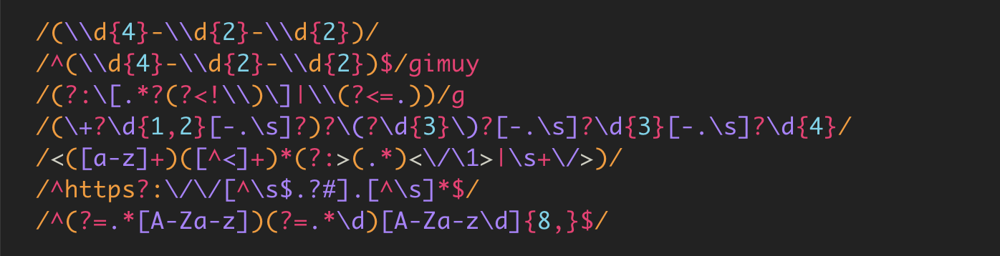

## Example Output



## Usage

```js
import { parse } from 'pretty-regex';

// Parse a regex pattern into a tree
const tree = parse(/foo(bar)+[a-z]/);

// Get the parsed AST
console.log(tree);

// Get colorized output
console.log(tree.print());
```

## API

### parse(regex)

Parse a regular expression pattern into a tree structure that can be used to create colorized output.

**Params**

* `regex` **{RegExp|String}**: The regex pattern to parse.

**Returns**

* `{Object}`: Returns a tree with nodes for each part of the regex.

**Example**

```js
import { parse } from 'pretty-regex';

// Parse a string pattern
const tree = parse('foo[a-z]');

// Or pass a RegExp instance
const tree = parse(/foo[a-z]/);

// Customize colors with your own print function
// or use the built-in tree.print() method
console.log(tree.print());
```

## Example

```ts
import util from 'node:util';
import { parse } from '~/parse';

const tree = parse(/^a(?<foo>z)[a-b]$/);

console.log(util.inspect(tree, { depth: null }));
// {
//   type: 'root',
//   value: '/^a(?<foo>z)[a-b]$/',
//   nodes: [
//     { type: 'slash', value: '/' },
//     { type: 'caret', value: '^' },
//     { type: 'text', value: 'a' },
//     {
//       type: 'paren',
//       value: '(?<foo>z)',
//       nodes: [
//         { type: 'left_paren', value: '(' },
//         { type: 'qmark', value: '?' },
//         {
//           type: 'angle',
//           value: '<foo>',
//           nodes: [
//             { type: 'left_angle', value: '<' },
//             { type: 'text', value: 'foo' },
//             { type: 'right_angle', value: '>' }
//           ]
//         },
//         { type: 'text', value: 'z' },
//         { type: 'right_paren', value: ')' }
//       ]
//     },
//     {
//       type: 'bracket',
//       value: '[a-b]',
//       nodes: [
//         { type: 'left_bracket', value: '[' },
//         { type: 'text', value: 'a-b' },
//         { type: 'right_bracket', value: ']' }
//       ]
//     },
//     { type: 'dollar', value: '$' },
//     { type: 'slash', value: '/' }
//   ]
// }

```
